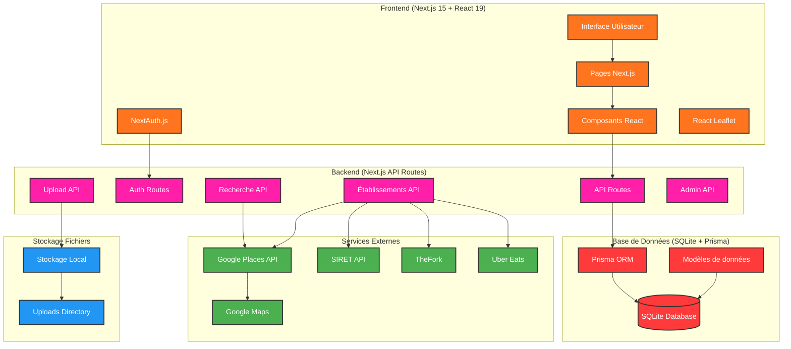
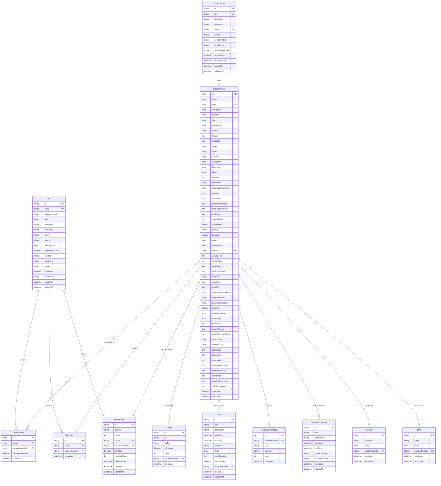

# Envie2Sortir - Plateforme Ultra-Locale de Divertissements

Une plateforme moderne et intuitive pour découvrir tous les établissements de divertissement près de chez vous.

### 🏠 Page d'Accueil Ultra-Performante
- **Hero Section** avec gradient orange-pink-rouge et slogan accrocheur
- **Barre de recherche intelligente** avec double input (ville + activité)
- **Effet typewriter** pour les suggestions d'activités
- **Géolocalisation** "Autour de moi" avec consentement utilisateur
- **Dropdowns dynamiques** pour villes et catégories d'activités
- **Sections visuelles** : meilleurs endroits, catégories, comment ça marche
- **Social Proof** avec témoignages utilisateurs
- **Section Pro** avec CTA pour référencer
- **Newsletter** et géolocalisation
- **Footer complet** avec liens et informations

### 🔍 Système de Recherche Avancé
- **Recherche par ville** avec suggestions automatiques
- **Recherche par catégorie** liée à la base de données
- **Géolocalisation** précise avec rayon de 5km
- **Filtres intelligents** : Populaire, Désirés ++, Les - cher, Notre sélection, Nouveaux, Mieux notés
- **Pagination infinie** avec système "Voir plus" (15 résultats par page)
- **Page de résultats** avec grille de cartes + carte interactive
- **Recherche "envie"** avec extraction de mots-clés intelligente
- **Filtre "Notre sélection"** : Établissements premium uniquement

### 🗺️ Carte Interactive
- **Intégration Leaflet.js** pour la cartographie
- **Marqueurs personnalisés** avec icône bleu distinctive
- **Popups adaptatifs** selon le contexte (accueil vs détail)
- **Centrage automatique** sur la zone de recherche
- **Marqueur de recherche** avec point central orange
- **Liens directs** vers les pages de détails

### 🏢 Gestion des Établissements
- **CRUD complet** : Création, Lecture, Mise à jour, Suppression
- **Formulaires intelligents** avec validation client et serveur
- **Génération automatique** de slugs SEO-friendly
- **Gestion des images** avec image principale
- **Système d'activités étendu** : VR, escape game, bowling, restaurant, bar, etc.
- **Enrichissement automatique** via Google Places API
- **Données hybrides** : automatiques + manuelles

### 🔐 Système d'Authentification
- **NextAuth.js** avec support multi-providers
- **Connexion par email/mot de passe**
- **Connexion sociale** (Google, Facebook) - optionnelle
- **Rôles utilisateurs** : Admin, Professionnel, Utilisateur
- **Architecture cohérente** : User (utilisateurs finaux) ↔ Professional (propriétaires) ↔ Establishment
- **Protection des routes** avec middleware
- **Gestion des sessions** avec hydratation optimisée

### 👥 Espaces Utilisateurs
- **Espace Professionnel** : Dashboard complet pour gérer son établissement
- **Espace Admin** : Gestion globale de la plateforme
- **Mon Compte** : Profil utilisateur avec favoris
- **Inscription simplifiée** : Création compte + établissement en une étape

### 🎯 Catégories d'Activités Avancées
- **Système d'activités détaillé** avec 50+ catégories
- **Mapping intelligent** des activités vers des labels courts
- **Support multi-activités** pour les établissements complexes
- **Filtrage dynamique** par ville et activité
- **Recherche sémantique** avec mots-clés

### 📅 Système d'Événements
- **Gestion complète** des événements par établissement
- **Filtrage temporel** : événements à venir uniquement
- **Affichage contextuel** : en cours vs à venir
- **Interface intuitive** avec cartes événements

### 🎨 Design System Responsive
- **Largeur adaptative** : max-w-6xl pour les écrans larges
- **Popups contextuels** : tailles ajustables selon l'usage
- **Système de réglages** facile pour les tailles de composants
- **Layout optimisé** pour tous les écrans (13" à 27"+)

## 🛠️ Technologies Utilisées

- **Frontend** : Next.js 15, React 19, TypeScript
- **Styling** : Tailwind CSS 4 avec thème personnalisé
- **Base de données** : SQLite avec Prisma ORM
- **Cartographie** : Leaflet.js
- **Authentification** : NextAuth.js
- **Géolocalisation** : API Web Geolocation + Nominatim
- **Enrichissement** : Google Places API
- **Déploiement** : Prêt pour Vercel/Netlify

## 🏗️ Architecture du Système



### Description de l'Architecture

#### 🎨 **Frontend (Next.js 15 + React 19)**
- **Interface Utilisateur** : Interface moderne avec Tailwind CSS utilisant la palette de couleurs orange-pink-rouge
- **Pages Next.js** : Pages statiques et dynamiques pour la navigation
- **Composants React** : Composants réutilisables (cartes d'établissements, formulaires, etc.)
- **NextAuth.js** : Authentification avec support Google/Facebook et credentials
- **React Leaflet** : Cartes interactives pour la géolocalisation

#### ⚙️ **Backend (Next.js API Routes)**
- **API Routes** : 44 endpoints API organisés par fonctionnalité
- **Auth Routes** : Gestion de l'authentification et des sessions
- **Recherche API** : Recherche intelligente avec filtres et géolocalisation
- **Établissements API** : CRUD des établissements avec enrichissement automatique
- **Upload API** : Gestion des images et fichiers
- **Admin API** : Administration et modération

#### 🗄️ **Base de Données (SQLite + Prisma)**
- **SQLite** : Base de données relationnelle pour le développement
- **Prisma ORM** : Gestion des modèles et migrations
- **Modèles** : 15+ modèles (User, Establishment, Event, Comment, etc.)

#### 🌐 **Services Externes**
- **Google Places API** : Enrichissement automatique des établissements
- **Google Maps** : Géolocalisation et cartes
- **API SIRET** : Vérification des professionnels
- **TheFork** : Intégration réservations restaurants
- **Uber Eats** : Liens de livraison

#### 📁 **Stockage Fichiers**
- **Stockage Local** : Images et fichiers uploadés
- **Uploads Directory** : Dossier public pour les médias

### Flux de Données Principaux

1. **Recherche d'Établissements** : `Utilisateur → Interface → API Recherche → Prisma → SQLite + Google Places`
2. **Authentification** : `Utilisateur → NextAuth → Auth API → Prisma → SQLite + OAuth`
3. **Création d'Établissement** : `Professionnel → Formulaire → API Établissements → Prisma → SQLite + Google Places`
4. **Upload d'Images** : `Utilisateur → Upload API → Stockage Local → Dossier Public`

## 🎨 Design System

### Couleurs Thème
- **Orange** : #ff751f
- **Pink** : #ff1fa9  
- **Rouge** : #ff3a3a
- **Fond** : Blanc (#ffffff)
- **Texte** : Noir (#171717)

### Typographie
- **Police principale** : Inter (Google Fonts)
- **Hiérarchie** : H1 (6xl), H2 (3xl), H3 (xl)
- **Responsive** : Mobile-first avec breakpoints Tailwind

### Composants
- **Cartes** avec gradients et effets hover
- **Boutons** avec dégradés et transitions
- **Formulaires** avec focus states et validation
- **Navigation** sticky avec logo et liens
- **Popups** adaptatifs selon le contexte

## 📱 Responsive Design

- **Mobile-first** approche
- **Grilles adaptatives** (1 → 2 → 4 → 6 colonnes)
- **Navigation mobile** optimisée
- **Cartes tactiles** pour mobile
- **Carte interactive** responsive
- **Largeur maximale** : 6xl pour les écrans larges
- **Espacement optimisé** pour tous les formats d'écran

## 🗄️ Structure de la Base de Données

### Architecture de la Base de Données

#### 🏗️ **Séparation des Responsabilités**

**User (Utilisateurs Finaux)**
- 👥 **Rôle** : Utilisateurs finaux du site
- ✅ **Peuvent** : chercher, liker, commenter, mettre en favoris
- ❌ **NE PEUVENT PAS** : créer/gérer des établissements
- 🔗 **Relations** : UserComment, UserFavorite, UserLike

**Professional (Propriétaires d'Établissements)**
- 🏢 **Rôle** : Propriétaires d'établissements
- ✅ **Seuls autorisés** à créer/gérer des établissements
- 🔍 **Vérification obligatoire** via SIRET
- 🔗 **Relation 1:1** avec Establishment

**Establishment (Établissements)**
- 🏪 **Rôle** : Établissements de sortie
- 👨‍💼 **Créés et gérés** uniquement par des Professionals
- ✅ **Système de validation** par l'admin avant publication
- 🔗 **Propriétaire** : Professional (relation 1:1 avec @unique)

### Diagramme Entité-Relation (ER)



### Modèles Principaux - Architecture Cohérente

#### User (Utilisateurs Finaux)
```prisma
model User {
  id              String   @id @default(cuid())
  email           String   @unique
  firstName       String?
  lastName        String?
  role            UserRole @default(user)
  favoriteCity    String?
  createdAt       DateTime @default(now())
  updatedAt       DateTime @updatedAt
  
  // Relations
  comments        UserComment[]
  favorites       UserFavorite[]
  likes           UserLike[]
}
```

#### Professional (Propriétaires d'Établissements)
```prisma
model Professional {
  id               String           @id @default(cuid())
  siret            String           @unique
  firstName        String
  lastName         String
  email            String           @unique
  phone            String
  companyName      String
  legalStatus      String
  subscriptionPlan SubscriptionPlan @default(FREE)
  siretVerified    Boolean          @default(false)
  siretVerifiedAt  DateTime?
  createdAt        DateTime         @default(now())
  updatedAt        DateTime         @updatedAt
  
  // Relations
  establishment    Establishment?   // Relation 1:1
}
```

#### Establishment (Établissements)
```prisma
model Establishment {
  id                    String   @id @default(cuid())
  name                  String
  slug                  String   @unique
  description           String?
  address               String
  city                  String?
  postalCode            String?
  country               String   @default("France")
  latitude              Float?
  longitude             Float?
  phone                 String?
  email                 String?
  website               String?
  instagram             String?
  facebook              String?
  tiktok                String?
  activities            Json?    // Système d'activités étendu
  specialites           String   @default("")
  motsClesRecherche     String?
  services              Json?    // Services organisés
  ambiance              Json?    // Ambiance organisée
  paymentMethods        Json?    // Moyens de paiement
  horairesOuverture     Json?    // Horaires
  prixMoyen             Float?
  capaciteMax           Int?
  accessibilite         Boolean  @default(false)
  parking               Boolean  @default(false)
  terrasse              Boolean  @default(false)
  status                EstablishmentStatus @default(pending)
  subscription          SubscriptionType    @default(STANDARD)
  ownerId               String   @unique    // FK vers Professional
  owner                 Professional @relation(fields: [ownerId], references: [id])
  viewsCount            Int      @default(0)
  clicksCount           Int      @default(0)
  avgRating             Float?
  totalComments         Int      @default(0)
  imageUrl              String?
  priceMax              Float?
  priceMin              Float?
  informationsPratiques Json?
  googlePlaceId         String?
  googleBusinessUrl     String?
  enriched              Boolean  @default(false)
  enrichmentData        Json?
  envieTags             String[]
  priceLevel            Int?
  googleRating          Float?
  googleReviewCount     Int?
  theForkLink           String?
  uberEatsLink          String?
  specialties           String[]
  atmosphere            String[]
  accessibility         String[]
  accessibilityDetails  Json?
  detailedServices      Json?
  clienteleInfo         String?
  detailedPayments      Json?
  childrenServices      Json?
  createdAt             DateTime @default(now())
  updatedAt             DateTime @updatedAt
  tags                  Tag[]
  events                Event[]
  featuredPromotions    Promotion[]
  images                Image[]
  pricing               Pricing[]
  tariffs               Tariff[]
  comments              Comment[]
  favorites             Favorite[]
  likes                 Like[]
}

model Event {
  id             String   @id @default(cuid())
  title          String
  description    String?
  startDate      DateTime
  endDate        DateTime?
  price          Float?
  maxCapacity    Int?
  establishmentId String
  establishment  Establishment @relation(fields: [establishmentId], references: [id])
  createdAt      DateTime @default(now())
  updatedAt      DateTime @updatedAt
}

enum UserRole {
  ADMIN
  PROFESSIONAL
  USER
}

enum EstablishmentStatus {
  DRAFT
  PENDING
  APPROVED
  REJECTED
  SUSPENDED
}

enum SubscriptionType {
  FREE
  BASIC
  PREMIUM
  ENTERPRISE
}
```

## 🚀 Installation et Démarrage

### Prérequis
- Node.js 18+ 
- npm ou yarn
- Git

### Installation
```bash
# Cloner le projet
git clone https://github.com/voicedhealer/envie2sortir.git
cd envie2sortir

# Installer les dépendances
npm install

# Configurer la base de données
cp .env.example .env.local
# Modifier les variables dans .env.local

# Générer le client Prisma
npx prisma generate

# Appliquer les migrations
npx prisma migrate dev

# Démarrer le serveur de développement
npm run dev
```

### Variables d'Environnement
```env
# Base de données
DATABASE_URL="file:./prisma/dev.db"

# NextAuth
NEXTAUTH_URL="http://localhost:3000"
NEXTAUTH_SECRET="your-secret-key"

# Google OAuth (optionnel)
GOOGLE_CLIENT_ID="your-google-client-id"
GOOGLE_CLIENT_SECRET="your-google-client-secret"

# Facebook OAuth (optionnel)
FACEBOOK_CLIENT_ID="your-facebook-client-id"
FACEBOOK_CLIENT_SECRET="your-facebook-client-secret"
```

## 📁 Structure du Projet

```
src/
├── app/
│   ├── api/                    # Routes API
│   │   ├── admin/              # API admin
│   │   ├── auth/               # Authentification
│   │   ├── categories/         # API catégories
│   │   ├── dashboard/          # API dashboard
│   │   ├── establishments/     # CRUD établissements
│   │   ├── etablissements/     # API établissements (FR)
│   │   ├── geocode/            # Géocodage
│   │   ├── google-places-proxy/ # Proxy Google Places
│   │   ├── professional/       # API professionnels
│   │   ├── recherche/          # API recherche
│   │   ├── upload/             # Upload d'images
│   │   └── user/               # API utilisateurs
│   ├── auth/                   # Pages d'authentification
│   ├── carte/                  # Page carte interactive
│   ├── dashboard/              # Dashboard professionnel
│   ├── etablissements/         # Gestion établissements
│   │   ├── [slug]/            # Pages détail établissement
│   │   └── nouveau/           # Création établissement
│   ├── mon-compte/            # Profil utilisateur
│   ├── recherche/             # Page résultats recherche
│   │   └── filtered/          # Page recherche filtrée
│   ├── sections/              # Composants landing page
│   ├── globals.css            # Styles globaux
│   ├── layout.tsx             # Layout principal
│   ├── navigation.tsx         # Navigation globale
│   └── page.tsx               # Page d'accueil
├── components/
│   ├── forms/                 # Formulaires
│   ├── EstablishmentCard.tsx  # Carte établissement
│   ├── EstablishmentGrid.tsx  # Grille établissements
│   ├── EstablishmentHero.tsx  # Hero établissement
│   ├── EstablishmentSections.tsx # Sections détail
│   ├── UpcomingEventsSection.tsx # Événements à venir
│   ├── MapComponent.tsx       # Carte interactive
│   ├── SearchFilters.tsx      # Filtres de recherche
│   ├── LoadMoreButton.tsx     # Bouton "Voir plus"
│   └── ...
├── lib/
│   ├── auth-config.ts         # Configuration NextAuth
│   ├── prisma.ts              # Client Prisma
│   ├── date-utils.ts          # Utilitaires dates
│   ├── enrichment-system.ts   # Système d'enrichissement
│   └── ...
└── types/
    └── next-auth.d.ts         # Types NextAuth
```

## 🔧 API Endpoints

### Authentification
- `POST /api/auth/register` - Inscription utilisateur
- `GET /api/auth/[...nextauth]` - NextAuth endpoints

### Catégories
- `GET /api/categories` - Liste des catégories avec compteurs
- `GET /api/categories?q=ville` - Filtrage par ville

### Établissements
- `GET /api/etablissements` - Liste des établissements
- `POST /api/etablissements` - Créer un établissement
- `PUT /api/etablissements/[slug]` - Modifier un établissement
- `DELETE /api/etablissements/[slug]` - Supprimer un établissement
- `GET /api/etablissements/[slug]/events` - Événements d'un établissement
- `POST /api/etablissements/enrich` - Enrichir via Google Places

### Recherche
- `GET /api/recherche/envie` - Recherche "envie" intelligente
- `GET /api/recherche/filtered` - Recherche avec filtres et pagination
- `GET /api/geocode` - Géocodage d'adresses

#### Exemples d'utilisation API Recherche Filtrée
```bash
# Recherche "escape" à Paris avec filtre populaire
GET /api/recherche/filtered?envie=escape&ville=Paris&filter=popular&page=1&limit=15

# Recherche "vr" à Dijon avec filtre "Les - cher"
GET /api/recherche/filtered?envie=vr&ville=Dijon&filter=cheap&page=1&limit=15

# Filtre "Notre sélection" (établissements premium uniquement)
GET /api/recherche/filtered?envie=restaurant&ville=Lyon&filter=premium&page=1&limit=15

# Pagination - page 2
GET /api/recherche/filtered?envie=bar&ville=Marseille&filter=popular&page=2&limit=15
```

#### Paramètres API
- `envie` (requis) : Terme de recherche
- `ville` : Ville de recherche (optionnel)
- `filter` : Type de filtre (popular, wanted, cheap, premium, newest, rating)
- `page` : Numéro de page (défaut: 1)
- `limit` : Nombre de résultats par page (défaut: 15)
- `lat`/`lng` : Coordonnées GPS (optionnel)

### Dashboard
- `GET /api/dashboard/stats` - Statistiques dashboard
- `GET /api/dashboard/establishments` - Établissements utilisateur

### Upload
- `POST /api/upload` - Upload d'images

## 🎯 Fonctionnalités Récentes

### ✅ Système d'Authentification Complet
- [x] NextAuth.js avec support multi-providers
- [x] Gestion des rôles (Admin, Professionnel, Utilisateur)
- [x] Protection des routes avec middleware
- [x] Hydratation de session optimisée

### ✅ Espaces Utilisateurs
- [x] Dashboard professionnel complet
- [x] Espace admin pour la gestion
- [x] Profil utilisateur avec favoris
- [x] Inscription simplifiée (compte + établissement)

### ✅ Système d'Enrichissement
- [x] Intégration Google Places API
- [x] Enrichissement automatique des données
- [x] Système hybride (auto + manuel)
- [x] Protection des données manuelles

### ✅ Carte Interactive Avancée
- [x] Marqueurs personnalisés
- [x] Popups adaptatifs selon le contexte
- [x] Marqueur de recherche central
- [x] Système de réglages facile

### ✅ Système d'Événements
- [x] Gestion complète des événements
- [x] Filtrage temporel intelligent
- [x] Interface utilisateur intuitive

### ✅ Design Responsive Optimisé
- [x] Largeur adaptative pour écrans larges
- [x] Système de réglages de tailles
- [x] Layout optimisé multi-écrans

### ✅ Système de Filtres et Pagination
- [x] 6 filtres intelligents avec icônes Lucide
- [x] Pagination infinie "Voir plus" (15 résultats/page)
- [x] Filtre "Notre sélection" (établissements premium)
- [x] API de recherche filtrée avec tri dynamique
- [x] Interface utilisateur intuitive et responsive
- [x] Compatible avec géolocalisation existante

#### 🎯 Filtres Disponibles
1. **Populaire** - Tri par nombre de vues (`viewsCount`)
2. **Désirés ++** - Tri par nombre de likes (`likesCount`)
3. **Les - cher** - Tri par prix croissant (`priceMin`)
4. **Notre sélection** - Établissements premium uniquement (`subscription = 'PREMIUM'`)
5. **Nouveaux** - Tri par date de création (`createdAt`)
6. **Mieux notés** - Tri par note moyenne (`avgRating`)

#### 📄 Pagination Intelligente
- **15 résultats par page** par défaut
- **Bouton "Voir plus"** avec états de chargement
- **Compteur dynamique** : "X affichés sur Y total"
- **Chargement progressif** sans rechargement de page
- **Compatible avec tous les filtres**

## 🎯 Fonctionnalités à Venir

- [ ] Système de réservation en ligne
- [ ] Notifications push et email
- [ ] Système d'avis et notes avancé
- [ ] Mode sombre/clair
- [ ] Application mobile PWA
- [ ] Intégration paiements
- [ ] Système de messagerie
- [ ] Analytics avancées

## 🤝 Contribution

1. Fork le projet
2. Créer une branche feature (`git checkout -b feature/AmazingFeature`)
3. Commit les changements (`git commit -m 'Add some AmazingFeature'`)
4. Push vers la branche (`git push origin feature/AmazingFeature`)
5. Ouvrir une Pull Request

## 📄 Licence

Ce projet est sous licence MIT. Voir le fichier `LICENSE` pour plus de détails.

## 📞 Contact

- **Développeur** : Vivien Bernardot
- **Projet** : Envie2Sortir
- **GitHub** : [voicedhealer/envie2sortir](https://github.com/voicedhealer/envie2sortir)

---

**Envie2Sortir** - Découvrez toutes vos envies, près de chez vous ! 🎉