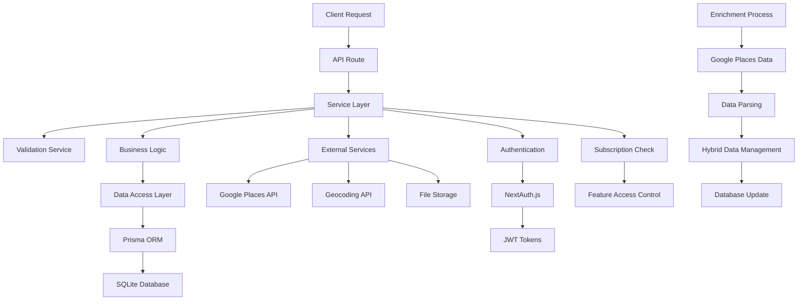

# Envie2Sortir - Plateforme Ultra-Locale de Divertissements

Une plateforme moderne et intuitive pour découvrir tous les établissements de divertissement près de chez vous.

### 🏠 Page d'Accueil Ultra-Performante
- **Hero Section** avec gradient orange-pink-rouge et slogan accrocheur
- **Barre de recherche intelligente** avec double input (ville + activité)
- **Effet typewriter** pour les suggestions d'activités
- **Géolocalisation** "Autour de moi" avec consentement utilisateur
- **Dropdowns dynamiques** pour villes et catégories d'activités
- **Sections visuelles** : meilleurs endroits, catégories, comment ça marche
- **Social Proof** avec témoignages utilisateurs
- **Section Pro** avec CTA pour référencer
- **Newsletter** et géolocalisation
- **Footer complet** avec liens et informations

### 🔍 Système de Recherche Avancé
- **Recherche par ville** avec suggestions automatiques
- **Recherche par catégorie** liée à la base de données
- **Géolocalisation** précise avec rayon de 5km
- **Filtres intelligents** : Populaire, Désirés ++, Les - cher, Notre sélection, Nouveaux, Mieux notés
- **Pagination infinie** avec système "Voir plus" (15 résultats par page)
- **Page de résultats** avec grille de cartes + carte interactive
- **Recherche "envie"** avec extraction de mots-clés intelligente
- **Filtre "Notre sélection"** : Établissements premium uniquement

### 🗺️ Carte Interactive
- **Intégration Leaflet.js** pour la cartographie
- **Marqueurs personnalisés** avec icône bleu distinctive
- **Popups adaptatifs** selon le contexte (accueil vs détail)
- **Centrage automatique** sur la zone de recherche
- **Marqueur de recherche** avec point central orange
- **Liens directs** vers les pages de détails

### 🏢 Gestion des Établissements
- **CRUD complet** : Création, Lecture, Mise à jour, Suppression
- **Formulaires intelligents** avec validation client et serveur
- **Génération automatique** de slugs SEO-friendly
- **Gestion des images** avec image principale
- **Système d'activités étendu** : VR, escape game, bowling, restaurant, bar, etc.
- **Enrichissement automatique** via Google Places API
- **Données hybrides** : automatiques + manuelles

### 🔐 Système d'Authentification
- **Supabase Auth** avec support multi-providers
- **Connexion par email/mot de passe**
- **Connexion sociale** (Google, Facebook) via OAuth
- **Rôles utilisateurs** : Admin, Professionnel, Utilisateur
- **Architecture cohérente** : User (utilisateurs finaux) ↔ Professional (propriétaires) ↔ Establishment
- **Protection des routes** avec middleware Supabase
- **Gestion des sessions** avec Supabase Auth (cookies sécurisés)

### 👥 Espaces Utilisateurs
- **Espace Professionnel** : Dashboard complet pour gérer son établissement
- **Espace Admin** : Gestion globale de la plateforme
- **Mon Compte** : Profil utilisateur avec favoris
- **Inscription simplifiée** : Création compte + établissement en une étape

### 🎯 Catégories d'Activités Avancées
- **Système d'activités détaillé** avec 50+ catégories
- **Mapping intelligent** des activités vers des labels courts
- **Support multi-activités** pour les établissements complexes
- **Filtrage dynamique** par ville et activité
- **Recherche sémantique** avec mots-clés

### 📅 Système d'Événements
- **Gestion complète** des événements par établissement
- **Filtrage temporel** : événements à venir uniquement
- **Affichage contextuel** : en cours vs à venir
- **Interface intuitive** avec cartes événements

### 🎨 Design System Responsive
- **Largeur adaptative** : max-w-6xl pour les écrans larges
- **Popups contextuels** : tailles ajustables selon l'usage
- **Système de réglages** facile pour les tailles de composants
- **Layout optimisé** pour tous les écrans (13" à 27"+)

## 🛠️ Technologies Utilisées

- **Frontend** : Next.js 15, React 19, TypeScript
- **Styling** : Tailwind CSS 4 avec thème personnalisé
- **Base de données** : PostgreSQL avec Supabase
- **ORM/Client** : Supabase Client (remplace Prisma)
- **Cartographie** : Leaflet.js
- **Authentification** : Supabase Auth (remplace NextAuth.js)
- **Storage** : Supabase Storage pour les fichiers et images
- **Géolocalisation** : API Web Geolocation + Nominatim
- **Enrichissement** : Google Places API
- **Déploiement** : Prêt pour Vercel/Netlify

## 🏗️ Architecture du Système

### Diagramme de Classes UML - Backend

```mermaid
classDiagram
    %% ===== CLASSES DE SERVICE PRINCIPALES =====
    
    class EstablishmentEnrichment {
        -String apiKey
        -EnrichmentData enrichmentData
        -String establishmentType
        
        +triggerGoogleEnrichment(googleUrl) Promise~EnrichmentData~
        -fetchGooglePlaceData(placeId, placeName) Promise~Object~
        -parseGooglePlaceData(placeData) EnrichmentData
        -generateEnvieTags(placeData) String[]
        -extractSpecialties(placeData) String[]
        -determineAtmosphere(placeData) String[]
        -extractAccessibilityInfo(placeData) AccessibilityInfo
        -extractPaymentMethods(placeData) String[]
        -extractServices(placeData) String[]
        -extractClienteleInfo(placeData) ClienteleInfo
        -extractChildrenServices(placeData) String[]
        -determinePriceLevel(placeData) Number
        -extractBusinessHours(placeData) Object
        -extractContactInfo(placeData) Object
        -extractSocialMedia(placeData) Object
        -extractImages(placeData) String[]
        -extractReviews(placeData) Object[]
        -calculateEnrichmentScore(placeData) Number
        -validateEnrichmentData(data) Boolean
    }

    class AuthService {
        -PrismaClient prisma
        -String jwtSecret
        
        +signUp(firstName, lastName, email, password) Promise~User~
        +signIn(email, password) Promise~AuthResult~
        +getCurrentUser(request) Promise~User~
        +hashPassword(password) Promise~String~
        +validateCredentials(email, password) Promise~Boolean~
        +generateToken(user) String
        +verifyToken(token) Promise~User~
        +refreshToken(userId) String
        -sanitizeUserInput(input) String
        -validateEmailFormat(email) Boolean
        -checkPasswordStrength(password) Boolean
    }

    class EstablishmentService {
        -PrismaClient prisma
        -ValidationService validator
        -EnrichmentService enricher
        
        +createEstablishment(data) Promise~Establishment~
        +updateEstablishment(id, data) Promise~Establishment~
        +deleteEstablishment(id) Promise~Boolean~
        +getEstablishmentBySlug(slug) Promise~Establishment~
        +searchEstablishments(query) Promise~Establishment[]~
        +getEstablishmentsByLocation(lat, lng, radius) Promise~Establishment[]~
        +getEstablishmentsByCategory(category) Promise~Establishment[]~
        +getFeaturedEstablishments() Promise~Establishment[]~
        +incrementViews(establishmentId) Promise~void~
        +incrementClicks(establishmentId) Promise~void~
        -validateEstablishmentData(data) Boolean
        -generateSlug(name) String
        -sanitizeEstablishmentData(data) Object
        -checkSlugUniqueness(slug) Promise~Boolean~
    }

    class SearchService {
        -PrismaClient prisma
        -ScoringService scorer
        -GeocodingService geocoder
        
        +searchByEnvie(query, location, radius) Promise~SearchResult[]~
        +searchByFilters(filters) Promise~Establishment[]~
        +calculateThematicScore(query, establishment) Number
        +extractKeywords(query) String[]
        +applySorting(establishments, filter) Establishment[]
        +geocodeAddress(address) Promise~Coordinates~
        +reverseGeocode(lat, lng) Promise~Address~
        +getNearbyEstablishments(lat, lng, radius) Promise~Establishment[]~
        -normalizeQuery(query) String
        -removeStopWords(query) String
        -calculateDistance(lat1, lng1, lat2, lng2) Number
        -validateSearchParameters(params) Boolean
    }

    class ProfessionalService {
        -PrismaClient prisma
        -SubscriptionService subscriptionService
        
        +createProfessional(data) Promise~Professional~
        +updateProfessional(id, data) Promise~Professional~
        +getProfessionalDashboard(professionalId) Promise~DashboardData~
        +createEstablishment(professionalId, data) Promise~Establishment~
        +updateEstablishment(professionalId, establishmentId, data) Promise~Establishment~
        +getProfessionalEstablishments(professionalId) Promise~Establishment[]~
        +validateSiret(siret) Promise~Boolean~
        +checkSubscriptionAccess(professionalId, feature) Promise~Boolean~
        +upgradeSubscription(professionalId, plan) Promise~Boolean~
        -validateProfessionalData(data) Boolean
        -checkSiretUniqueness(siret) Promise~Boolean~
    }

    class EventService {
        -PrismaClient prisma
        -SubscriptionService subscriptionService
        
        +createEvent(establishmentId, data) Promise~Event~
        +updateEvent(eventId, data) Promise~Event~
        +deleteEvent(eventId) Promise~Boolean~
        +getEstablishmentEvents(establishmentId) Promise~Event[]~
        +getUpcomingEvents(establishmentId) Promise~Event[]~
        +getEventById(eventId) Promise~Event~
        +searchEvents(query) Promise~Event[]~
        -validateEventData(data) Boolean
        -checkEventConflicts(establishmentId, startDate, endDate) Promise~Boolean~
        -calculateEventDuration(startDate, endDate) Number
    }

    class ImageService {
        -FileStorageService storage
        -PrismaClient prisma
        -SubscriptionService subscriptionService
        
        +uploadImage(establishmentId, file) Promise~Image~
        +deleteImage(imageId) Promise~Boolean~
        +getEstablishmentImages(establishmentId) Promise~Image[]~
        +setPrimaryImage(establishmentId, imageId) Promise~Boolean~
        +reorderImages(establishmentId, imageIds) Promise~Boolean~
        +validateImageFile(file) Boolean
        +processImage(file) Promise~ProcessedImage~
        +generateThumbnail(image) Promise~String~
        -checkImageLimit(establishmentId) Promise~Boolean~
        -generateUniqueFilename(originalName) String
    }

    class SubscriptionService {
        -PrismaClient prisma
        
        +validateSubscriptionAccess(subscription, feature) ValidationResult
        +getSubscriptionFeatures(subscription) SubscriptionFeatures
        +upgradeSubscription(establishmentId, newPlan) Promise~Boolean~
        +downgradeSubscription(establishmentId, newPlan) Promise~Boolean~
        +getSubscriptionLimits(subscription) SubscriptionLimits
        +checkFeatureAccess(subscription, feature) Boolean
        +getPremiumRequiredError(feature) ErrorResponse
        -calculateUpgradePrice(currentPlan, newPlan) Number
        -validatePlanTransition(currentPlan, newPlan) Boolean
    }

    class ValidationService {
        +validateEstablishmentData(data) ValidationResult
        +validateUserData(data) ValidationResult
        +validateEventData(data) ValidationResult
        +validateImageFile(file) ValidationResult
        +sanitizeInput(input) String
        +sanitizeRequestBody(body) Object
        +validateEmail(email) Boolean
        +validatePhone(phone) Boolean
        +validateUrl(url) Boolean
        +validateCoordinates(lat, lng) Boolean
        -sanitizeString(input) String
        -validateRequiredFields(data, requiredFields) Boolean
    }

    class GeocodingService {
        -String apiKey
        
        +geocodeAddress(address) Promise~Coordinates~
        +reverseGeocode(lat, lng) Promise~Address~
        +validateAddress(address) Promise~Boolean~
        +getAddressComponents(address) Promise~AddressComponents~
        +calculateDistance(lat1, lng1, lat2, lng2) Number
        +getBoundingBox(lat, lng, radius) BoundingBox
        -callGeocodingAPI(address) Promise~Object~
        -parseGeocodingResponse(response) Coordinates
    }

    class GooglePlacesService {
        -String apiKey
        
        +fetchPlaceDetails(placeId) Promise~PlaceDetails~
        +searchPlaces(query, location) Promise~Place[]~
        +getPlacePhotos(placeId) Promise~String[]~
        +getPlaceReviews(placeId) Promise~Review[]~
        +resolveGoogleUrl(url) Promise~PlaceId~
        +validatePlaceId(placeId) Boolean
        -callGooglePlacesAPI(endpoint, params) Promise~Object~
        -parsePlaceDetails(response) PlaceDetails
        -parsePlaceSearch(response) Place[]
    }

    class FileStorageService {
        -String uploadPath
        -String[] allowedTypes
        -Number maxFileSize
        
        +uploadFile(file, path) Promise~String~
        +deleteFile(path) Promise~Boolean~
        +generateUrl(path) String
        +validateFileType(file) Boolean
        +validateFileSize(file) Boolean
        +generateUniquePath(originalName) String
        +createDirectory(path) Promise~Boolean~
        -sanitizeFileName(fileName) String
    }

    class ScoringService {
        +calculateThematicScore(query, establishment) Number
        +calculateRelevanceScore(query, establishment) Number
        +calculateDistanceScore(establishment, userLocation) Number
        +calculateRatingScore(establishment) Number
        +calculatePopularityScore(establishment) Number
        +extractKeywords(query) String[]
        +removeStopWords(keywords) String[]
        +calculateKeywordMatch(query, establishment) Number
        +calculateTagMatch(query, tags) Number
        -normalizeText(text) String
        -calculateTFIDF(term, document, documents) Number
    }

    %% ===== TYPES ET INTERFACES =====
    
    class EnrichmentData {
        +String name
        +String address
        +String phone
        +String website
        +String[] activities
        +String[] services
        +String[] ambiance
        +String[] paymentMethods
        +Object businessHours
        +String[] images
        +Number rating
        +Number reviewCount
        +String[] specialties
        +String[] atmosphere
        +AccessibilityInfo accessibility
        +String[] clienteleInfo
        +String[] childrenServices
        +Number priceLevel
        +Object contactInfo
        +Object socialMedia
        +Review[] reviews
        +String[] parking
    }

    class SearchResult {
        +Establishment establishment
        +Number score
        +Number distance
        +String[] matchedKeywords
        +String reason
    }

    class ValidationResult {
        +Boolean isValid
        +String[] errors
        +String[] warnings
    }

    class SubscriptionFeatures {
        +Number maxImages
        +Boolean canCreateEvents
        +Boolean canCreatePromotions
        +Boolean canAccessAnalytics
        +Boolean canCustomizeProfile
    }

    class Coordinates {
        +Number latitude
        +Number longitude
    }

    class Address {
        +String street
        +String city
        +String postalCode
        +String country
        +String formattedAddress
    }

    %% ===== RELATIONS ENTRE CLASSES =====
    
    EstablishmentService --> ValidationService : "utilise"
    EstablishmentService --> EstablishmentEnrichment : "utilise"
    SearchService --> ScoringService : "utilise"
    SearchService --> GeocodingService : "utilise"
    ProfessionalService --> SubscriptionService : "utilise"
    EventService --> SubscriptionService : "utilise"
    ImageService --> FileStorageService : "utilise"
    ImageService --> SubscriptionService : "utilise"
    EstablishmentEnrichment --> GooglePlacesService : "utilise"
    AuthService --> ValidationService : "utilise"
```



### Descriptions des Classes Principales

#### **EstablishmentEnrichment**
**Description** : Classe principale pour l'enrichissement automatique des établissements via Google Places API.
- **Responsabilités** : Récupération, parsing et transformation des données Google Places
- **Méthodes clés** : `triggerGoogleEnrichment()`, `fetchGooglePlaceData()`, `parseGooglePlaceData()`
- **Données enrichies** : Activités, services, ambiance, moyens de paiement, accessibilité, etc.

#### **AuthService**
**Description** : Service d'authentification et de gestion des utilisateurs.
- **Responsabilités** : Inscription, connexion, validation des credentials, gestion des tokens
- **Méthodes clés** : `signUp()`, `signIn()`, `getCurrentUser()`, `hashPassword()`
- **Sécurité** : Hachage des mots de passe, validation des entrées, gestion des sessions

#### **EstablishmentService**
**Description** : Service de gestion des établissements (CRUD, recherche, géolocalisation).
- **Responsabilités** : Création, modification, suppression, recherche d'établissements
- **Méthodes clés** : `createEstablishment()`, `searchEstablishments()`, `getEstablishmentsByLocation()`
- **Fonctionnalités** : Géolocalisation, génération de slugs, statistiques de vues

#### **SearchService**
**Description** : Service de recherche intelligente avec scoring thématique.
- **Responsabilités** : Recherche par "envie", filtrage, scoring, géolocalisation
- **Méthodes clés** : `searchByEnvie()`, `calculateThematicScore()`, `extractKeywords()`
- **Algorithme** : Scoring basé sur la pertinence thématique, distance, et popularité

#### **ProfessionalService**
**Description** : Service de gestion des professionnels et de leurs établissements.
- **Responsabilités** : Gestion des comptes professionnels, validation SIRET, abonnements
- **Méthodes clés** : `createProfessional()`, `validateSiret()`, `checkSubscriptionAccess()`
- **Validation** : Vérification SIRET, gestion des abonnements FREE/PREMIUM

#### **EventService**
**Description** : Service de gestion des événements des établissements.
- **Responsabilités** : Création, modification, suppression d'événements
- **Méthodes clés** : `createEvent()`, `getUpcomingEvents()`, `checkEventConflicts()`
- **Restrictions** : Accès limité aux établissements PREMIUM

#### **ImageService**
**Description** : Service de gestion des images et fichiers multimédias.
- **Responsabilités** : Upload, suppression, réorganisation des images
- **Méthodes clés** : `uploadImage()`, `setPrimaryImage()`, `reorderImages()`
- **Limites** : Gestion des quotas selon l'abonnement (1 image FREE, 10 PREMIUM)

#### **SubscriptionService**
**Description** : Service de gestion des abonnements et des fonctionnalités.
- **Responsabilités** : Validation des accès, gestion des plans, limites de fonctionnalités
- **Méthodes clés** : `validateSubscriptionAccess()`, `getSubscriptionFeatures()`
- **Plans** : STANDARD (gratuit) et PREMIUM (payant)

#### **ValidationService**
**Description** : Service de validation et de sanitisation des données.
- **Responsabilités** : Validation des entrées, sanitisation, vérification des formats
- **Méthodes clés** : `validateEstablishmentData()`, `sanitizeInput()`, `validateEmail()`
- **Sécurité** : Protection contre les injections, validation des types

#### **GeocodingService**
**Description** : Service de géocodage et de géolocalisation.
- **Responsabilités** : Conversion adresse ↔ coordonnées, calculs de distance
- **Méthodes clés** : `geocodeAddress()`, `reverseGeocode()`, `calculateDistance()`
- **Intégration** : API de géocodage externe

#### **GooglePlacesService**
**Description** : Service d'intégration avec Google Places API.
- **Responsabilités** : Récupération des données Google Places, résolution d'URLs
- **Méthodes clés** : `fetchPlaceDetails()`, `searchPlaces()`, `resolveGoogleUrl()`
- **Données** : Détails des lieux, photos, avis, informations de contact

#### **FileStorageService**
**Description** : Service de gestion des fichiers et du stockage.
- **Responsabilités** : Upload, suppression, validation des fichiers
- **Méthodes clés** : `uploadFile()`, `deleteFile()`, `validateFileType()`
- **Sécurité** : Validation des types de fichiers, limitation de taille

#### **ScoringService**
**Description** : Service de calcul des scores de pertinence pour la recherche.
- **Responsabilités** : Calcul des scores thématiques, de distance, de popularité
- **Méthodes clés** : `calculateThematicScore()`, `extractKeywords()`, `calculateRelevanceScore()`
- **Algorithme** : TF-IDF, matching de mots-clés, scoring multi-critères

### Flux de Données et Relations



### Technologies et Patterns Utilisés

- **Architecture** : Service Layer Pattern, Repository Pattern
- **Validation** : Zod schemas, custom validation services
- **Authentification** : NextAuth.js, JWT tokens
- **Base de données** : Prisma ORM, SQLite
- **Services externes** : Google Places API, Geocoding services
- **Sécurité** : Input sanitization, SQL injection prevention
- **Performance** : Caching, pagination, lazy loading
- **Monitoring** : Request logging, error tracking

### Architecture Générale du Système

```mermaid
graph TB
    %% Frontend Layer
    subgraph "Frontend (Next.js 15 + React 19)"
        UI[Interface Utilisateur]
        Pages[Pages Next.js]
        Components[Composants React]
        Auth[NextAuth.js]
        Maps[React Leaflet]
    end

    %% Backend Layer
    subgraph "Backend (Next.js API Routes)"
        API[API Routes]
        AuthAPI[Auth Routes]
        SearchAPI[Recherche API]
        EstabAPI[Établissements API]
        UploadAPI[Upload API]
        AdminAPI[Admin API]
    end

    %% Database Layer
    subgraph "Base de Données (SQLite + Prisma)"
        DB[(SQLite Database)]
        Prisma[Prisma ORM]
        Models[Modèles de données]
    end

    %% External Services
    subgraph "Services Externes"
        GooglePlaces[Google Places API]
        GoogleMaps[Google Maps]
        SIRET[SIRET API]
        TheFork[TheFork]
        UberEats[Uber Eats]
    end

    %% File Storage
    subgraph "Stockage Fichiers"
        LocalStorage[Stockage Local]
        Uploads[Uploads Directory]
    end

    %% Data Flow
    UI --> Pages
    Pages --> Components
    Components --> API
    Auth --> AuthAPI
    
    API --> Prisma
    Prisma --> DB
    Models --> DB
    
    SearchAPI --> GooglePlaces
    EstabAPI --> GooglePlaces
    EstabAPI --> SIRET
    
    UploadAPI --> LocalStorage
    LocalStorage --> Uploads
    
    GooglePlaces --> GoogleMaps
    EstabAPI --> TheFork
    EstabAPI --> UberEats

    %% Styling
    classDef frontend fill:#ff751f,stroke:#333,stroke-width:2px,color:#fff
    classDef backend fill:#ff1fa9,stroke:#333,stroke-width:2px,color:#fff
    classDef database fill:#ff3a3a,stroke:#333,stroke-width:2px,color:#fff
    classDef external fill:#4CAF50,stroke:#333,stroke-width:2px,color:#fff
    classDef storage fill:#2196F3,stroke:#333,stroke-width:2px,color:#fff

    class UI,Pages,Components,Auth,Maps frontend
    class API,AuthAPI,SearchAPI,EstabAPI,UploadAPI,AdminAPI backend
    class DB,Supabase,PostgreSQL database
    class GooglePlaces,GoogleMaps,SIRET,TheFork,UberEats external
    class SupabaseStorage,Storage storage
```



### Description de l'Architecture

#### 🎨 **Frontend (Next.js 15 + React 19)**
- **Interface Utilisateur** : Interface moderne avec Tailwind CSS utilisant la palette de couleurs orange-pink-rouge
- **Pages Next.js** : Pages statiques et dynamiques pour la navigation
- **Composants React** : Composants réutilisables (cartes d'établissements, formulaires, etc.)
- **Supabase Auth** : Authentification avec support Google/Facebook OAuth et email/password
- **React Leaflet** : Cartes interactives pour la géolocalisation

#### ⚙️ **Backend (Next.js API Routes)**
- **API Routes** : 44 endpoints API organisés par fonctionnalité
- **Auth Routes** : Gestion de l'authentification et des sessions
- **Recherche API** : Recherche intelligente avec filtres et géolocalisation
- **Établissements API** : CRUD des établissements avec enrichissement automatique
- **Upload API** : Gestion des images et fichiers
- **Admin API** : Administration et modération

#### 🗄️ **Base de Données (PostgreSQL + Supabase)**
- **PostgreSQL** : Base de données relationnelle via Supabase
- **Supabase Client** : Client JavaScript pour les requêtes et l'authentification
- **RLS (Row Level Security)** : Sécurité au niveau des lignes pour toutes les tables
- **Modèles** : 19+ tables (users, professionals, establishments, events, comments, etc.)

#### 🌐 **Services Externes**
- **Google Places API** : Enrichissement automatique des établissements
- **Google Maps** : Géolocalisation et cartes
- **API SIRET** : Vérification des professionnels
- **Twilio** : Vérification du numéro du propriétaire
- **TheFork** : Liens de réservations restaurants
- **Uber Eats** : Liens de livraison

#### 📁 **Stockage Fichiers**
- **Supabase Storage** : Stockage cloud pour images et fichiers
- **Buckets** : 5 buckets configurés (establishments, events, deals, menus, avatars)
- **CDN** : URLs publiques via CDN Supabase pour les médias

### Flux de Données Principaux

1. **Recherche d'Établissements** : `Utilisateur → Interface → API Recherche → Supabase → PostgreSQL + Google Places`
2. **Authentification** : `Utilisateur → Supabase Auth → Auth API → Supabase → PostgreSQL + OAuth`
3. **Création d'Établissement** : `Professionnel → Formulaire → API Établissements → Supabase → PostgreSQL + Google Places`
4. **Upload d'Images** : `Utilisateur → Upload API → Supabase Storage → CDN Public`

## 🎨 Design System

### Couleurs Thème
- **Orange** : #ff751f
- **Pink** : #ff1fa9  
- **Rouge** : #ff3a3a
- **Fond** : Blanc (#ffffff)
- **Texte** : Noir (#171717)

### Typographie
- **Police principale** : Inter (Google Fonts)
- **Hiérarchie** : H1 (6xl), H2 (3xl), H3 (xl)
- **Responsive** : Mobile-first avec breakpoints Tailwind

### Composants
- **Cartes** avec gradients et effets hover
- **Boutons** avec dégradés et transitions
- **Formulaires** avec focus states et validation
- **Navigation** sticky avec logo et liens
- **Popups** adaptatifs selon le contexte

## 📱 Responsive Design

- **Mobile-first** approche
- **Grilles adaptatives** (1 → 2 → 4 → 6 colonnes)
- **Navigation mobile** optimisée
- **Cartes tactiles** pour mobile
- **Carte interactive** responsive
- **Largeur maximale** : 6xl pour les écrans larges
- **Espacement optimisé** pour tous les formats d'écran

## 🗄️ Structure de la Base de Données

### Architecture de la Base de Données

#### 🏗️ **Séparation des Responsabilités**

**User (Utilisateurs Finaux)**
- 👥 **Rôle** : Utilisateurs finaux du site
- ✅ **Peuvent** : chercher, mettre en favoris, laisser un avis, interagir avec les cards events social
- ❌ **NE PEUVENT PAS** : créer/gérer des établissements
- 🔗 **Relations** : UserComment, UserFavorite, UserLike

**Professional (Propriétaires d'Établissements)**
- 🏢 **Rôle** : Propriétaires d'établissements
- ✅ **Seuls autorisés** à créer/gérer des établissements
- 🔍 **Vérification obligatoire** via SIRET
- 🔗 **Relation 1:1** avec Establishment

**Establishment (Établissements)**
- 🏪 **Rôle** : Établissements de sortie
- 👨‍💼 **Créés et gérés** uniquement par des Professionals
- ✅ **Système de validation** par l'admin avant publication
- 🔗 **Propriétaire** : Professional (relation 1:1 avec @unique)

### Diagramme Entité-Relation (ER) - Architecture Unifiée

```mermaid
erDiagram
    %% ENTITÉS PRINCIPALES
    User {
        string id PK
        string email UK
        string passwordHash
        string firstName
        string lastName
        string name
        string phone
        json preferences
        boolean newsletterOptIn
        string provider
        string providerId
        string avatar
        boolean isVerified
        string favoriteCity
        enum role "user|admin"
        datetime createdAt
        datetime updatedAt
    }

    Professional {
        string id PK
        string siret UK
        string firstName
        string lastName
        string email UK
        string passwordHash
        string phone
        string companyName
        string legalStatus
        enum subscriptionPlan "FREE|PREMIUM"
        boolean siretVerified
        datetime siretVerifiedAt
        datetime createdAt
        datetime updatedAt
    }

    Establishment {
        string id PK
        string name
        string slug UK
        string description
        string address
        string city
        string postalCode
        string country
        float latitude
        float longitude
        string phone
        string email
        string website
        string instagram
        string facebook
        json activities
        string specialites
        string motsClesRecherche
        json services
        json ambiance
        json paymentMethods
        json horairesOuverture
        float prixMoyen
        int capaciteMax
        boolean accessibilite
        boolean parking
        boolean terrasse
        enum status "pending|approved|rejected"
        enum subscription "FREE|STANDARD|PREMIUM"
        string ownerId FK
        int viewsCount
        int clicksCount
        float avgRating
        int totalComments
        datetime createdAt
        datetime updatedAt
        string tiktok
        string imageUrl
        float priceMax
        float priceMin
        json informationsPratiques
        string googlePlaceId
        string googleBusinessUrl
        boolean enriched
        json enrichmentData
        json envieTags
        int priceLevel
        float googleRating
        int googleReviewCount
        string theForkLink
        string uberEatsLink
        json specialties
        json atmosphere
        json accessibility
        json accessibilityDetails
        json detailedServices
        json clienteleInfo
        json detailedPayments
        json childrenServices
    }

    %% ENTITÉS DE RELATION
    UserComment {
        string id PK
        string content
        int rating
        string userId FK
        string establishmentId FK
        datetime createdAt
        datetime updatedAt
    }

    UserFavorite {
        string id PK
        string userId FK
        string establishmentId FK
        datetime createdAt
    }

    UserLike {
        string id PK
        string userId FK
        string establishmentId FK
        datetime createdAt
    }

    EtablissementTag {
        string id PK
        string etablissementId FK
        string tag
        string typeTag
        int poids
        datetime createdAt
    }

    Event {
        string id PK
        string title
        string description
        string imageUrl
        string establishmentId FK
        datetime startDate
        datetime endDate
        float price
        int maxCapacity
        boolean isRecurring
        datetime createdAt
        datetime updatedAt
    }

    FeaturedPromotion {
        string id PK
        string title
        string description
        string establishmentId FK
        datetime startDate
        datetime endDate
        float discount
        datetime createdAt
        datetime updatedAt
    }

    Image {
        string id PK
        string url
        string altText
        boolean isPrimary
        int ordre
        string establishmentId FK
        datetime createdAt
    }

    Pricing {
        string id PK
        string name
        string description
        float price
        string establishmentId FK
        datetime createdAt
        datetime updatedAt
    }

    Tariff {
        string id PK
        string name
        string description
        float price
        string establishmentId FK
        datetime createdAt
        datetime updatedAt
    }

    %% RELATIONS PRINCIPALES
    Professional ||--o| Establishment : "possède (1:1)"
    Professional {
        string id PK
    }
    Establishment {
        string ownerId FK
    }

    %% RELATIONS UTILISATEURS
    User ||--o{ UserComment : "écrit"
    User ||--o{ UserFavorite : "favorise"
    User ||--o{ UserLike : "aime"

    %% RELATIONS ÉTABLISSEMENTS
    Establishment ||--o{ UserComment : "reçoit"
    Establishment ||--o{ UserFavorite : "est favorisé"
    Establishment ||--o{ UserLike : "est aimé"
    Establishment ||--o{ EtablissementTag : "a des tags"
    Establishment ||--o{ Event : "organise"
    Establishment ||--o{ FeaturedPromotion : "propose"
    Establishment ||--o{ Image : "a des images"
    Establishment ||--o{ Pricing : "a des tarifs"
    Establishment ||--o{ Tariff : "a des forfaits"
```



### 🏗️ **Points Clés de l'Architecture Unifiée**

#### **1. SÉPARATION CLAIRE DES RÔLES :**
- **`User`** : Clients simples (consultation, commentaires, favoris)
- **`Professional`** : Propriétaires d'établissements (création, gestion)

#### **2. RELATION 1:1 OBLIGATOIRE :**
- **`Professional` ↔ `Establishment`** : Un professionnel = Un établissement maximum
- **`ownerId`** : Clé étrangère directe vers `Professional.id`

#### **3. SYSTÈME D'AUTHENTIFICATION UNIFIÉ :**
- **NextAuth** gère les deux types via `userType`
- **Recherche automatique** dans les deux tables lors de la connexion

#### **4. VALIDATION ET SÉCURITÉ :**
- **SIRET obligatoire** pour les professionnels
- **Statut d'établissement** : `pending` → `approved` → `rejected`
- **Vérification admin** avant publication

#### **5. FONCTIONNALITÉS UTILISATEURS :**
- **Commentaires** : `User` → `Establishment`
- **Favoris** : `User` → `Establishment` (relation unique)
- **Likes** : `User` → `Establishment` (relation unique)

Cette architecture garantit une séparation claire des responsabilités tout en maintenant une cohérence dans le système d'authentification ! 🚀

### Modèles Principaux - Architecture Cohérente

#### User (Utilisateurs Finaux)
```prisma
model User {
  id              String   @id @default(cuid())
  email           String   @unique
  firstName       String?
  lastName        String?
  role            UserRole @default(user)
  favoriteCity    String?
  createdAt       DateTime @default(now())
  updatedAt       DateTime @updatedAt
  
  // Relations
  comments        UserComment[]
  favorites       UserFavorite[]
  likes           UserLike[]
}
```

#### Professional (Propriétaires d'Établissements)
```prisma
model Professional {
  id               String           @id @default(cuid())
  siret            String           @unique
  firstName        String
  lastName         String
  email            String           @unique
  phone            String
  companyName      String
  legalStatus      String
  subscriptionPlan SubscriptionPlan @default(FREE)
  siretVerified    Boolean          @default(false)
  siretVerifiedAt  DateTime?
  createdAt        DateTime         @default(now())
  updatedAt        DateTime         @updatedAt
  
  // Relations
  establishment    Establishment?   // Relation 1:1
}
```

#### Establishment (Établissements)
```prisma
model Establishment {
  id                    String   @id @default(cuid())
  name                  String
  slug                  String   @unique
  description           String?
  address               String
  city                  String?
  postalCode            String?
  country               String   @default("France")
  latitude              Float?
  longitude             Float?
  phone                 String?
  email                 String?
  website               String?
  instagram             String?
  facebook              String?
  tiktok                String?
  activities            Json?    // Système d'activités étendu
  specialites           String   @default("")
  motsClesRecherche     String?
  services              Json?    // Services organisés
  ambiance              Json?    // Ambiance organisée
  paymentMethods        Json?    // Moyens de paiement
  horairesOuverture     Json?    // Horaires
  prixMoyen             Float?
  capaciteMax           Int?
  accessibilite         Boolean  @default(false)
  parking               Boolean  @default(false)
  terrasse              Boolean  @default(false)
  status                EstablishmentStatus @default(pending)
  subscription          SubscriptionType    @default(STANDARD)
  ownerId               String   @unique    // FK vers Professional
  owner                 Professional @relation(fields: [ownerId], references: [id])
  viewsCount            Int      @default(0)
  clicksCount           Int      @default(0)
  avgRating             Float?
  totalComments         Int      @default(0)
  imageUrl              String?
  priceMax              Float?
  priceMin              Float?
  informationsPratiques Json?
  googlePlaceId         String?
  googleBusinessUrl     String?
  enriched              Boolean  @default(false)
  enrichmentData        Json?
  envieTags             String[]
  priceLevel            Int?
  googleRating          Float?
  googleReviewCount     Int?
  theForkLink           String?
  uberEatsLink          String?
  specialties           String[]
  atmosphere            String[]
  accessibility         String[]
  accessibilityDetails  Json?
  detailedServices      Json?
  clienteleInfo         String?
  detailedPayments      Json?
  childrenServices      Json?
  createdAt             DateTime @default(now())
  updatedAt             DateTime @updatedAt
  tags                  Tag[]
  events                Event[]
  featuredPromotions    Promotion[]
  images                Image[]
  pricing               Pricing[]
  tariffs               Tariff[]
  comments              Comment[]
  favorites             Favorite[]
  likes                 Like[]
}

model Event {
  id             String   @id @default(cuid())
  title          String
  description    String?
  startDate      DateTime
  endDate        DateTime?
  price          Float?
  maxCapacity    Int?
  establishmentId String
  establishment  Establishment @relation(fields: [establishmentId], references: [id])
  createdAt      DateTime @default(now())
  updatedAt      DateTime @updatedAt
}

enum UserRole {
  ADMIN
  PROFESSIONAL
  USER
}

enum EstablishmentStatus {
  DRAFT
  PENDING
  APPROVED
  REJECTED
  SUSPENDED
}

enum SubscriptionType {
  FREE
  BASIC
  PREMIUM
  ENTERPRISE
}
```
## 📊 Diagrammes de Séquence - Interactions Critiques

### 1. 🔐 Connexion Utilisateur (Authentification)

```mermaid
sequenceDiagram
    participant U as Utilisateur
    participant F as Frontend (React)
    participant A as NextAuth API
    participant D as Database (Prisma)
    participant S as Session Store

    U->>F: 1. Accède à /auth
    F->>U: 2. Affiche formulaire de connexion
    
    U->>F: 3. Saisit email + mot de passe
    F->>A: 4. POST /api/auth/signin
    A->>D: 5. SELECT user WHERE email = ?
    D-->>A: 6. Retourne utilisateur + hash
    
    A->>A: 7. Vérifie mot de passe (bcrypt)
    alt Mot de passe correct
        A->>S: 8. Crée session JWT
        S-->>A: 9. Token de session
        A-->>F: 10. Succès + redirection
        F->>U: 11. Redirige vers dashboard
    else Mot de passe incorrect
        A-->>F: 12. Erreur d'authentification
        F->>U: 13. Affiche message d'erreur
    end
```



### 2. 🔍 Recherche d'Établissements (Cas Principal)

```mermaid
sequenceDiagram
    participant U as Utilisateur
    participant F as Frontend (React)
    participant A as API /recherche
    participant D as Database (Prisma)
    participant G as Google Places API
    participant M as Map Component

    U->>F: 1. Saisit ville + activité
    F->>A: 2. POST /api/recherche/filtered
    A->>D: 3. SELECT establishments WHERE city = ? AND activities LIKE ?
    D-->>A: 4. Liste des établissements
    
    A->>A: 5. Calcul distances + filtres
    A->>G: 6. Enrichissement données (optionnel)
    G-->>A: 7. Données complémentaires
    
    A-->>F: 8. Résultats paginés (15/page)
    F->>M: 9. Affiche carte interactive
    F->>U: 10. Grille de cartes + carte
    
    U->>F: 11. Clique sur établissement
    F->>U: 12. Redirige vers /etablissements/[slug]
```



### 3. 🏢 Création d'Établissement (Professionnel)

```mermaid
sequenceDiagram
    participant P as Professionnel
    participant F as Frontend (React)
    participant A as API /etablissements
    participant D as Database (Prisma)
    participant G as Google Places API
    participant S as Storage (Images)

    P->>F: 1. Accède à /etablissements/nouveau
    F->>P: 2. Affiche formulaire multi-étapes
    
    P->>F: 3. Remplit informations de base
    F->>A: 4. POST /api/etablissements avec données
    A->>D: 5. INSERT INTO establishments
    D-->>A: 6. ID de l'établissement créé
    
    P->>F: 7. Upload images
    F->>S: 8. POST /api/upload/image
    S-->>F: 9. URLs des images
    F->>A: 10. PUT /api/etablissements/images
    
    A->>G: 11. Enrichissement automatique
    G-->>A: 12. Données Google Places
    A->>D: 13. UPDATE establishment avec données enrichies
    
    A-->>F: 14. Succès + slug généré
    F->>P: 15. Redirige vers dashboard pro
```



### 📋 Résumé des Interactions Critiques

#### 🔐 Authentification (Cas 1)
- **Composants** : Frontend → NextAuth → Database → Session Store
- **Points critiques** : Vérification bcrypt, gestion JWT, protection des routes
- **Sécurité** : Hashage des mots de passe, tokens sécurisés

#### 🔍 Recherche (Cas 2)
- **Composants** : Frontend → API Recherche → Database → Google Places → Map
- **Points critiques** : Filtrage intelligent, pagination, géolocalisation
- **Performance** : Requêtes optimisées, cache des résultats

#### �� Création Établissement (Cas 3)
- **Composants** : Frontend → API CRUD → Database → Google Places → Storage
- **Points critiques** : Validation multi-étapes, enrichissement automatique
- **UX** : Formulaire progressif, upload d'images, génération de slug

#### �� Points Techniques Clés

**Architecture des Interactions :**
1. **Frontend React** : Interface utilisateur et gestion d'état
2. **API Next.js** : Logique métier et validation
3. **Database Prisma** : Persistance des données
4. **Services externes** : Google Places, Storage, Auth

**Flux de Données :**
- **Synchronisation** : Session ↔ Database ↔ Frontend
- **Validation** : Client-side + Server-side
- **Enrichissement** : Données automatiques + sélection manuelle des informations pertinentes
- **Performance** : Cache, pagination, requêtes optimisées

## 🚀 Installation et Démarrage

### Prérequis
- Node.js 18+ 
- npm ou yarn
- Git

### Installation
```bash
# Cloner le projet
git clone https://github.com/voicedhealer/envie2sortir.git
cd envie2sortir

# Installer les dépendances
npm install

# Configurer la base de données
cp .env
# Modifier les variables dans .env

# Générer le client Prisma
npx prisma generate

# Appliquer les migrations
npx prisma migrate dev

# Démarrer le serveur de développement
npm run dev
```

### Variables d'Environnement
```env
# Base de données
DATABASE_URL="file:./prisma/dev.db"

# NextAuth
NEXTAUTH_URL="http://localhost:3000"
NEXTAUTH_SECRET="your-secret-key"

# Google OAuth (optionnel)
GOOGLE_CLIENT_ID="your-google-client-id"
GOOGLE_CLIENT_SECRET="your-google-client-secret"

# Facebook OAuth (optionnel)
FACEBOOK_CLIENT_ID="your-facebook-client-id"
FACEBOOK_CLIENT_SECRET="your-facebook-client-secret"
```

## 📁 Structure du Projet

```
src/
├── app/
│   ├── api/                    # Routes API
│   │   ├── admin/              # API admin
│   │   ├── auth/               # Authentification
│   │   ├── categories/         # API catégories
│   │   ├── dashboard/          # API dashboard
│   │   ├── establishments/     # CRUD établissements
│   │   ├── etablissements/     # API établissements (FR)
│   │   ├── geocode/            # Géocodage
│   │   ├── google-places-proxy/ # Proxy Google Places
│   │   ├── professional/       # API professionnels
│   │   ├── recherche/          # API recherche
│   │   ├── upload/             # Upload d'images
│   │   └── user/               # API utilisateurs
│   ├── auth/                   # Pages d'authentification
│   ├── carte/                  # Page carte interactive
│   ├── dashboard/              # Dashboard professionnel
│   ├── etablissements/         # Gestion établissements
│   │   ├── [slug]/            # Pages détail établissement
│   │   └── nouveau/           # Création établissement
│   ├── mon-compte/            # Profil utilisateur
│   ├── recherche/             # Page résultats recherche
│   │   └── filtered/          # Page recherche filtrée
│   ├── sections/              # Composants landing page
│   ├── globals.css            # Styles globaux
│   ├── layout.tsx             # Layout principal
│   ├── navigation.tsx         # Navigation globale
│   └── page.tsx               # Page d'accueil
├── components/
│   ├── forms/                 # Formulaires
│   ├── EstablishmentCard.tsx  # Carte établissement
│   ├── EstablishmentGrid.tsx  # Grille établissements
│   ├── EstablishmentHero.tsx  # Hero établissement
│   ├── EstablishmentSections.tsx # Sections détail
│   ├── UpcomingEventsSection.tsx # Événements à venir
│   ├── MapComponent.tsx       # Carte interactive
│   ├── SearchFilters.tsx      # Filtres de recherche
│   ├── LoadMoreButton.tsx     # Bouton "Voir plus"
│   └── ...
├── lib/
│   ├── auth-config.ts         # Configuration NextAuth
│   ├── prisma.ts              # Client Prisma
│   ├── date-utils.ts          # Utilitaires dates
│   ├── enrichment-system.ts   # Système d'enrichissement
│   └── ...
└── types/
    └── next-auth.d.ts         # Types NextAuth
```

## 🔧 API Endpoints

### Authentification
- `POST /api/auth/register` - Inscription utilisateur
- `POST /api/auth/login` - Connexion utilisateur
- `GET /api/auth/[...nextauth]` - NextAuth endpoints
- `POST /api/auth/verify-establishment` - Vérification établissement
- `POST /api/verify-phone` - Vérification SMS
- `POST /api/check-email` - Vérification disponibilité email
- `POST /api/check-siret` - Vérification SIRET

### Catégories
- `GET /api/categories` - Liste des catégories avec compteurs
- `GET /api/categories?q=ville` - Filtrage par ville

### Établissements
- `GET /api/etablissements` - Liste des établissements
- `POST /api/etablissements` - Créer un établissement
- `PUT /api/etablissements/[slug]` - Modifier un établissement
- `DELETE /api/etablissements/[slug]` - Supprimer un établissement
- `GET /api/etablissements/[slug]/events` - Événements d'un établissement
- `POST /api/etablissements/enrich` - Enrichir via Google Places
- `GET /api/etablissements/[slug]/images` - Images d'un établissement
- `POST /api/etablissements/create-admin` - Création admin d'établissement
- `GET /api/establishments/all` - Tous les établissements (admin)
- `GET /api/establishments/random` - Établissements aléatoires
- `POST /api/establishments/correct-type` - Correction type d'établissement
- `POST /api/establishments/suggest-type` - Suggestion type d'établissement
- `POST /api/establishments/save-pattern` - Sauvegarde pattern d'apprentissage

### Recherche
- `GET /api/recherche/envie` - Recherche "envie" intelligente
- `GET /api/recherche/filtered` - Recherche avec filtres et pagination
- `GET /api/geocode` - Géocodage d'adresses
- `POST /api/google-places-proxy` - Proxy Google Places
- `POST /api/resolve-google-url` - Résolution URL Google

### Dashboard Professionnel
- `GET /api/dashboard/stats` - Statistiques dashboard
- `GET /api/dashboard/establishments` - Établissements utilisateur
- `GET /api/dashboard/events` - Événements utilisateur
- `POST /api/dashboard/events` - Créer un événement
- `PUT /api/dashboard/events/[id]` - Modifier un événement
- `DELETE /api/dashboard/events/[id]` - Supprimer un événement
- `GET /api/dashboard/images` - Images utilisateur
- `POST /api/dashboard/images` - Upload d'images
- `PUT /api/dashboard/images/[id]` - Modifier une image
- `DELETE /api/dashboard/images/[id]` - Supprimer une image
- `POST /api/dashboard/images/reorder` - Réorganiser les images
- `POST /api/dashboard/images/set-card-image` - Définir image principale
- `POST /api/dashboard/change-password` - Changer mot de passe

### Bons Plans Journaliers
- `GET /api/deals/all` - Tous les bons plans actifs
- `POST /api/deals` - Créer un bon plan
- `GET /api/deals/[establishmentId]` - Bons plans d'un établissement
- `PUT /api/deals/[dealId]` - Modifier un bon plan
- `DELETE /api/deals/[dealId]` - Supprimer un bon plan
- `GET /api/deals/active/[establishmentId]` - Bon plan actif du jour
- `GET /api/deals/by-establishment/[establishmentId]` - Bons plans par établissement
- `POST /api/deals/engagement` - Engagement sur un bon plan
- `POST /api/deals/recurrence/process` - Traitement récurrence
- `POST /api/upload/deal-media` - Upload images/PDFs bons plans

### Événements
- `GET /api/events/upcoming` - Événements à venir
- `POST /api/events/[eventId]/engage` - Engagement sur un événement

### Messagerie
- `GET /api/messaging/conversations` - Liste des conversations
- `POST /api/messaging/conversations` - Créer une conversation
- `GET /api/messaging/conversations/[id]` - Détails d'une conversation
- `POST /api/messaging/conversations/[id]/messages` - Envoyer un message
- `PATCH /api/messaging/conversations/[id]/read` - Marquer comme lu
- `PATCH /api/messaging/conversations/[id]/status` - Changer le statut
- `GET /api/messaging/unread-count` - Compter les messages non lus

### Analytics et Monitoring
- `GET /api/analytics/track` - Tracking des interactions
- `GET /api/analytics/search` - Analytics de recherche
- `POST /api/analytics/search/track` - Tracking recherche
- `GET /api/analytics/detailed` - Analytics détaillées
- `GET /api/monitoring/health` - Santé de l'application
- `GET /api/monitoring/liveness` - Vérification de vie
- `GET /api/monitoring/readiness` - Vérification de disponibilité
- `GET /api/monitoring/metrics` - Métriques de performance

### Administration
- `GET /api/admin/stats` - Statistiques globales
- `GET /api/admin/metrics` - Métriques admin
- `GET /api/admin/pending-count` - Compteur en attente
- `GET /api/admin/establishments` - Gestion établissements
- `POST /api/admin/establishments/actions` - Actions sur établissements
- `GET /api/admin/professionals` - Liste des professionnels
- `POST /api/admin/actions` - Actions admin générales
- `POST /api/admin/cleanup-images` - Nettoyage images orphelines
- `GET /api/admin/learning/patterns` - Patterns d'apprentissage
- `POST /api/admin/learning/validate` - Valider un pattern
- `POST /api/admin/learning/correct` - Corriger un pattern
- `DELETE /api/admin/learning/delete` - Supprimer un pattern
- `GET /api/admin/learning/stats` - Statistiques d'apprentissage
- `GET /api/admin/newsletter/subscribers` - Abonnés newsletter
- `GET /api/admin/newsletter/stats` - Statistiques newsletter
- `POST /api/admin/newsletter/toggle` - Activer/désactiver abonnement
- `DELETE /api/admin/newsletter/delete` - Supprimer abonnement
- `GET /api/admin/newsletter/export` - Export newsletter
- `POST /api/admin/review-update` - Mise à jour avis

### Professionnels
- `POST /api/professional-registration` - Inscription professionnel
- `GET /api/professional/establishment` - Établissement du professionnel
- `POST /api/professional/request-update` - Demande de mise à jour
- `POST /api/professional/send-verification-sms` - Envoi SMS vérification
- `POST /api/professional/verify-sms-code` - Vérification code SMS
- `POST /api/professional/verify-email` - Vérification email
- `GET /api/professional/update-requests` - Demandes de mise à jour

### Utilisateurs
- `GET /api/user/favorites` - Favoris utilisateur
- `POST /api/user/favorites/[id]` - Ajouter aux favoris
- `DELETE /api/user/favorites/[id]` - Retirer des favoris
- `GET /api/user/comments` - Commentaires utilisateur
- `POST /api/user/comments` - Créer un commentaire
- `PUT /api/user/comments/[id]` - Modifier un commentaire
- `DELETE /api/user/comments/[id]` - Supprimer un commentaire
- `POST /api/user/update-profile` - Mettre à jour le profil
- `POST /api/user/delete-account` - Supprimer le compte
- `GET /api/user/gamification` - Données de gamification
- `POST /api/user/location-preferences` - Préférences de localisation

### Commentaires et Signalements
- `POST /api/comments/[id]/reply` - Répondre à un commentaire
- `POST /api/comments/[id]/report` - Signaler un commentaire

### Upload et Médias
- `POST /api/upload/image` - Upload d'images
- `POST /api/upload/optimized-image` - Upload d'images optimisées
- `POST /api/upload/event-image` - Upload d'images d'événements
- `POST /api/upload/deal-media` - Upload médias bons plans

### Sécurité
- `GET /api/csrf/token` - Token CSRF

### Newsletter
- `POST /api/newsletter/subscribe` - S'abonner à la newsletter
- `POST /api/newsletter/unsubscribe` - Se désabonner

### Menus et Documents
- `GET /api/public/establishments/[slug]/menus` - Menus publics
- `GET /api/establishments/[id]/menus` - Menus d'établissement
- `POST /api/establishments/[id]/menus` - Créer un menu
- `GET /api/establishments/[id]/menus/[menuId]` - Détails d'un menu
- `PUT /api/establishments/[id]/menus/[menuId]` - Modifier un menu
- `DELETE /api/establishments/[id]/menus/[menuId]` - Supprimer un menu
- `POST /api/establishments/[id]/menus/upload` - Upload de menus PDF

#### Exemples d'utilisation API Recherche Filtrée
```bash
# Recherche "escape" à Paris avec filtre populaire
GET /api/recherche/filtered?envie=escape&ville=Paris&filter=popular&page=1&limit=15

# Recherche "vr" à Dijon avec filtre "Les - cher"
GET /api/recherche/filtered?envie=vr&ville=Dijon&filter=cheap&page=1&limit=15

# Filtre "Notre sélection" (établissements premium uniquement)
GET /api/recherche/filtered?envie=restaurant&ville=Lyon&filter=premium&page=1&limit=15

# Pagination - page 2
GET /api/recherche/filtered?envie=bar&ville=Marseille&filter=popular&page=2&limit=15
```

#### Paramètres API Recherche
- `envie` (requis) : Terme de recherche
- `ville` : Ville de recherche (optionnel)
- `filter` : Type de filtre (popular, wanted, cheap, premium, newest, rating)
- `page` : Numéro de page (défaut: 1)
- `limit` : Nombre de résultats par page (défaut: 15)
- `lat`/`lng` : Coordonnées GPS (optionnel)

## 🎯 Fonctionnalités Récentes

### ✅ Système d'Authentification Complet
- [x] NextAuth.js avec support multi-providers
- [x] Gestion des rôles (Admin, Professionnel, Utilisateur)
- [x] Protection des routes avec middleware
- [x] Hydratation de session optimisée
- [x] Vérification SMS pour les professionnels
- [x] Suppression de compte utilisateur

### ✅ Espaces Utilisateurs Avancés
- [x] Dashboard professionnel complet avec analytics
- [x] Espace admin refait avec gestion complète
- [x] Profil utilisateur avec favoris et préférences
- [x] Inscription simplifiée (compte + établissement)
- [x] Gestion des préférences de localisation
- [x] Système de badges et gamification

### ✅ Système d'Enrichissement Intelligent
- [x] Intégration Google Places API
- [x] Enrichissement automatique des données
- [x] Système hybride (auto + manuel)
- [x] Protection des données manuelles
- [x] Système de learning patterns pour améliorer l'enrichissement
- [x] Suggestions automatiques de type d'établissement

### ✅ Carte Interactive Avancée
- [x] Marqueurs personnalisés
- [x] Popups adaptatifs selon le contexte
- [x] Marqueur de recherche central
- [x] Système de réglages facile
- [x] Géolocalisation améliorée avec historique des villes

### ✅ Système d'Événements et Engagement
- [x] Gestion complète des événements
- [x] Filtrage temporel intelligent
- [x] Interface utilisateur intuitive
- [x] Système de likes/dislikes pour les événements
- [x] Statistiques d'engagement en temps réel
- [x] Gauge d'engagement visuelle

### ✅ Design Responsive Optimisé
- [x] Largeur adaptative pour écrans larges
- [x] Système de réglages de tailles
- [x] Layout optimisé multi-écrans
- [x] Mode mobile-first avec navigation optimisée

### ✅ Système de Filtres et Pagination
- [x] 6 filtres intelligents avec icônes Lucide
- [x] Pagination infinie "Voir plus" (15 résultats/page)
- [x] Filtre "Notre sélection" (établissements premium)
- [x] API de recherche filtrée avec tri dynamique
- [x] Interface utilisateur intuitive et responsive
- [x] Compatible avec géolocalisation existante

#### 🎯 Filtres Disponibles
1. **Populaire** - Tri par nombre de vues (`viewsCount`)
2. **Désirés ++** - Tri par nombre de likes (`likesCount`)
3. **Les - cher** - Tri par prix croissant (`priceMin`)
4. **Notre sélection** - Établissements premium uniquement (`subscription = 'PREMIUM'`)
5. **Nouveaux** - Tri par date de création (`createdAt`)
6. **Mieux notés** - Tri par note moyenne (`avgRating`)

#### 📄 Pagination Intelligente
- **15 résultats par page** par défaut
- **Bouton "Voir plus"** avec états de chargement
- **Compteur dynamique** : "X affichés sur Y total"
- **Chargement progressif** sans rechargement de page
- **Compatible avec tous les filtres**

### 🎯 Système de Bons Plans Journaliers (NOUVEAU)
- [x] **Dashboard Premium** : Création et gestion des bons plans
- [x] **Programmation** : Dates et horaires avec activation automatique
- [x] **Upload multimédia** : Images et PDFs pour les offres
- [x] **Affichage intelligent** : Modal automatique + card permanente
- [x] **Page dédiée** : `/bons-plans` avec carousel et grille
- [x] **Redirection fluide** : Clic → établissement concerné
- [x] **Design cohérent** : Bordure orange néon sur fond blanc crème
- [x] **API complète** : `/api/deals/*` pour toutes les opérations

### 💬 Système de Messagerie Pro-Admin (NOUVEAU)
- [x] **Communication bidirectionnelle** : Professionnels ↔ Administrateurs
- [x] **Interface complète** : Liste des conversations avec filtres
- [x] **Badges de notification** : Compteur de messages non lus
- [x] **Polling automatique** : Mise à jour toutes les 30 secondes
- [x] **Gestion des statuts** : Conversations ouvertes/fermées
- [x] **Pages dédiées** : `/dashboard/messagerie` et `/admin/messagerie`
- [x] **Sécurité** : Permissions strictes et validation des données

### 📊 Analytics et Monitoring Avancés (NOUVEAU)
- [x] **Dashboard analytics** : Statistiques détaillées pour les professionnels
- [x] **Tracking des clics** : Suivi des interactions utilisateurs
- [x] **Monitoring de santé** : Endpoints `/api/monitoring/*`
- [x] **Métriques de performance** : Temps de réponse et logs
- [x] **Analytics de recherche** : Tracking des requêtes et résultats
- [x] **Statistiques d'engagement** : Likes, vues, favoris

### 🔒 Sécurité Renforcée (NOUVEAU)
- [x] **Protection CSRF** : Tokens et validation côté serveur
- [x] **Rate limiting étendu** : Protection contre les abus
- [x] **Validation stricte** : Sanitisation des entrées utilisateur
- [x] **Protection XSS/SQL** : Tests de sécurité complets
- [x] **Tests de pénétration** : Suite de tests de sécurité automatisés
- [x] **Audit de sécurité** : Logs et monitoring des tentatives d'intrusion

### 🏢 Administration Complète (NOUVEAU)
- [x] **Interface admin refaite** : Design moderne et intuitif
- [x] **Gestion des établissements** : Analytics et modération
- [x] **Système de learning** : Patterns d'amélioration automatique
- [x] **Gestion newsletter** : Abonnés et campagnes
- [x] **Modération** : Commentaires et signalements
- [x] **Statistiques globales** : Vue d'ensemble de la plateforme

### 📄 Pages Légales et Support (NOUVEAU)
- [x] **Pages légales** : CGV, conditions, mentions légales
- [x] **Support utilisateur** : Page de contact et FAQ
- [x] **Désinscription** : Page dédiée pour la newsletter
- [x] **À propos** : Présentation de la plateforme
- [x] **Politique de confidentialité** : Conformité RGPD

### 🧪 Tests et Qualité (NOUVEAU)
- [x] **Suite de tests complète** : 120+ tests unitaires et d'intégration
- [x] **Tests E2E** : Playwright pour les parcours utilisateurs
- [x] **Tests de sécurité** : Validation contre les attaques courantes
- [x] **Tests de performance** : Mesure des temps de réponse
- [x] **Coverage de code** : Rapport de couverture des tests
- [x] **Tests de régression** : Prévention des régressions

## 🔒 Sécurité et Qualité

### Protection CSRF
- **Tokens CSRF** : Génération et validation automatique
- **Middleware de protection** : Validation côté serveur
- **Endpoints sécurisés** : `/api/csrf/token` pour récupérer les tokens

### Rate Limiting
- **Protection contre les abus** : Limitation des requêtes par IP
- **Endpoints protégés** : Upload, authentification, recherche
- **Configuration flexible** : Limites adaptées par type d'opération

### Validation et Sanitisation
- **Validation stricte** : Tous les inputs utilisateur sont validés
- **Sanitisation XSS** : Protection contre les injections de scripts
- **Validation SQL** : Protection contre les injections SQL via Prisma
- **Caractères spéciaux** : Support Unicode et émojis sécurisé

### Tests de Sécurité
- **Suite de tests complète** : 60+ tests de sécurité automatisés
- **Tests de pénétration** : Validation contre les attaques courantes
- **Tests d'injection** : SQL, XSS, et autres vecteurs d'attaque
- **Tests d'autorisation** : Vérification des permissions

## 🧪 Tests et Qualité

### Couverture de Tests
- **120+ tests unitaires** : Couverture complète des fonctionnalités
- **Tests d'intégration** : Validation des flux complets
- **Tests E2E** : Parcours utilisateurs avec Playwright
- **Tests de performance** : Mesure des temps de réponse

### Types de Tests
- **Tests de sécurité** : Protection contre les attaques
- **Tests de performance** : Optimisation des requêtes
- **Tests de régression** : Prévention des bugs
- **Tests d'accessibilité** : Conformité aux standards

### Outils de Test
- **Jest** : Tests unitaires et d'intégration
- **Playwright** : Tests E2E avec navigateurs réels
- **Coverage** : Rapport de couverture de code
- **CI/CD** : Intégration continue avec GitHub Actions

## 📊 Monitoring et Analytics

### Monitoring de Santé
- **Endpoints de santé** : `/api/monitoring/health`
- **Vérifications de vie** : `/api/monitoring/liveness`
- **Vérifications de disponibilité** : `/api/monitoring/readiness`
- **Métriques de performance** : `/api/monitoring/metrics`

### Analytics Utilisateur
- **Tracking des clics** : Suivi des interactions utilisateurs
- **Analytics de recherche** : Requêtes et résultats populaires
- **Statistiques d'engagement** : Likes, vues, favoris
- **Dashboard analytics** : Interface pour les professionnels

### Logs et Debugging
- **Logs structurés** : Format JSON pour faciliter l'analyse
- **Niveaux de log** : Error, Warning, Info, Debug
- **Corrélation des requêtes** : Traçabilité des actions utilisateur
- **Monitoring des erreurs** : Détection automatique des problèmes

## 🎯 Fonctionnalités à Venir

### Court Terme (Q1 2025)
- [ ] **Système de réservation en ligne** : Intégration avec calendriers et paiements
- [ ] **Notifications push et email** : Alertes temps réel pour les utilisateurs
- [ ] **Mode sombre/clair** : Thème adaptatif selon les préférences
- [ ] **Application mobile PWA** : Version mobile native

### Moyen Terme (Q2-Q3 2025)
- [ ] **Intégration paiements** : Stripe/PayPal pour les réservations
- [ ] **Système d'avis avancé** : Reviews détaillées avec photos
- [ ] **Chat en temps réel** : WebSocket pour la messagerie instantanée
- [ ] **Recommandations IA** : Suggestions personnalisées basées sur l'historique
- [ ] **Système de fidélité** : Points et récompenses pour les utilisateurs

### Long Terme (Q4 2025+)
- [ ] **API publique** : Ouverture pour les partenaires tiers
- [ ] **Marketplace** : Plateforme pour les services complémentaires
- [ ] **Intelligence artificielle** : Chatbot et assistance automatique
- [ ] **Reality augmentée** : Visite virtuelle des établissements
- [ ] **Blockchain** : Système de réputation décentralisé

### Améliorations Techniques
- [ ] **Cache Redis** : Optimisation des performances
- [ ] **CDN global** : Distribution mondiale du contenu
- [ ] **Microservices** : Architecture distribuée
- [ ] **Kubernetes** : Orchestration des conteneurs
- [ ] **Monitoring avancé** : APM et alertes proactives

## 🤝 Contribution

1. Fork le projet
2. Créer une branche feature (`git checkout -b feature/AmazingFeature`)
3. Commit les changements (`git commit -m 'Add some AmazingFeature'`)
4. Push vers la branche (`git push origin feature/AmazingFeature`)
5. Ouvrir une Pull Request

## 📄 Licence

Ce projet est sous licence MIT. Voir le fichier `LICENSE` pour plus de détails.

## 📞 Contact

- **Développeur** : Vivien Bernardot
- **Projet** : Envie2Sortir
- **GitHub** : [voicedhealer/envie2sortir](https://github.com/voicedhealer/envie2sortir)

---

## 📈 Mise à Jour du README (Octobre 2025)

### ✅ Nouvelles Fonctionnalités Documentées
- **🎯 Système de Bons Plans Journaliers** : Gestion complète pour les établissements Premium
- **💬 Système de Messagerie Pro-Admin** : Communication bidirectionnelle avec notifications
- **📊 Analytics et Monitoring Avancés** : Tracking et métriques de performance
- **🔒 Sécurité Renforcée** : Protection CSRF, rate limiting, tests de sécurité
- **🏢 Administration Complète** : Interface admin refaite avec analytics
- **📄 Pages Légales et Support** : CGV, CGU, FAQ, contact, conformité RGPD, politique de confidentialité
- **🧪 Tests et Qualité** : 120+ tests avec couverture complète

### 📋 API Endpoints Mis à Jour
- **80+ endpoints** documentés et organisés par catégorie
- **Nouvelles routes** : Bons plans, messagerie, analytics, monitoring
- **Exemples d'utilisation** : Paramètres et cas d'usage détaillés
- **Documentation complète** : Authentification, upload, sécurité

### 🔧 Sections Techniques Ajoutées
- **Sécurité et Qualité** : CSRF, rate limiting, validation, tests
- **Tests et Qualité** : Couverture, outils, types de tests
- **Monitoring et Analytics** : Santé, logs, métriques de performance
- **Fonctionnalités à Venir** : Roadmap organisée par échéances

### 📊 Statistiques du Projet
- **Technologies** : Next.js 15, React 19, TypeScript, Prisma, SQLite
- **Tests** : 120+ tests unitaires, E2E, sécurité, performance
- **API** : 80+ endpoints organisés en 15 catégories
- **Fonctionnalités** : 50+ fonctionnalités implémentées et documentées

---

**Envie2Sortir** - Découvrez toutes vos envies, près de chez vous ! 🎉